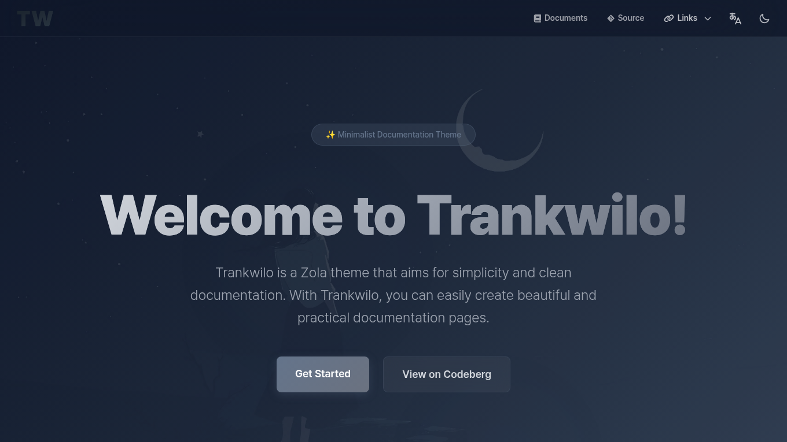

<div align="center">
  <p>Goyo is a <a href="https://www.getzola.org/">Zola</a> theme that aims for simplicity and clean documentation.</p>
</div>

<p align="center">
  <a href="https://goyo.hahwul.com"></a>
  <a href="https://github.com/hahwul/goyo/blob/main/CONTRIBUTING.md"></a>
  <a href="https://www.getzola.org/"></a>
</p>

## Features

- Dark & Light Themes
- Responsive Design
- SEO-Friendly
- Multi-Language Support
- Auto-Generated Sidebar & Custom Nav
- Comments (Giscus, Utterances)
- Various shortcodes (Mermaid, Asciinema, etc.)
- Customization

## Installation

Make your zola app

```bash
zola init yoursite
cd yoursite
```

Add the theme as a git submodule:

```bash
git init  # if your project is a git repository already, ignore this command
git submodule add https://github.com/hahwul/goyo themes/goyo
```

Or clone the theme into your themes directory:

```bash
git clone https://github.com/hahwul/goyo themes/goyo
```

Then set `goyo` as your theme in `config.toml`.

```toml
title = "Your Docs"
theme = "goyo"
```

## Configuration

Add extra field in config.toml

```toml
[extra]
logo_text = "Goyo"
logo_image_path = "images/goyo.png"
footer_html = "Powered by <a href='https://www.getzola.org'>Zola</a> and <a href='https://github.com/hahwul/goyo'>Goyo</a>"
default_thumbnail = "images/default_thumbnail.jpg"
twitter_site = "@hahwul"
twitter_creator = "@hahwul"
default_colorset = "dark"
gtag = ""
sidebar_expand_depth = 1
disable_root_sidebar_hide = false

nav = [
    { name = "Documents", url = "/introduction", type = "url" },
    { name = "GitHub", url = "https://github.com/hahwul/goyo", type = "url" },
    { name = "Links", type = "dropdown", members = [
        { name = "Creator Blog", url = "https://www.hahwul.com", type = "url" },
    ] },
]
```

More information? [https://goyo.hahwul.com/get_started/configuration/](https://goyo.hahwul.com/get_started/configuration/)

## Run

```bash
zola serve

# and open http://localhost:1111 in your browser.
```


